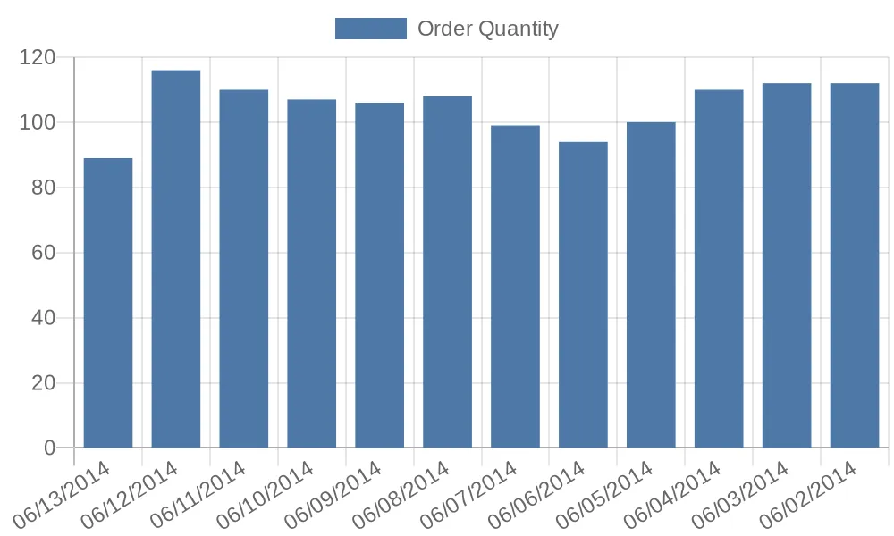

<!--🔥 🐦 -->
<h1>
🔥 notiflyer 🐦
</h1> 
an inspiring new way of sending KPIs, alerts, or simple tabular data as emails powered by chart.js by converting raw data into meaningful visual graphs and charts.

notiflyer is an attempt to prove that ETL operations can be left out from the presentation layer and focusing on the KPIs derived from said analytical operations by capturing and storing end values in simple sql objects (*tables/views,etc.*) in a statistical X/Y axis format.


<!-- 


-->

#  📑 about
the principle of this project is simple - focus on the data over logic.

separate logic from data by breaking away from traditional, normalized and resource-intensive ways of running OLTP analytical queries for generating simple KPI metrics that end up causing massive loads on i/o, memory, etc. as it traverses through hundreds, if not thousands of entries/tables on a production database. 

instead, abstract the layer of logic/ETL and introduce a new one that comprises of ***only*** the end-goal metric data stored in simple sql objects such as temporary/permanent tables or views (*support for functions/stored procedures is in progress*) 

eventually leading to maintaining focus on developing sleek and light weight presentation layer focused queries, to generate clean visual representation of the dataset itself, that can be sliced and diced several ways, depending on the recepients' choice.

# 💎 features
* automates overhead tasks for sql such as:
    * sql agent jobs, maintenance
    * error/run logging
    * db mail setup & configuration, etc.
* data remains at core focus - leave the visualization logic to the application
* highly extensive configuration settings 📚

# 🖼️ design principles & architecture
this project is determined in keeping the need for technical know-how to a bare minimum when it comes to setup, configuring and maintaining; as most of the end-users for this application, would be focused on handling the business/analytics side and not so much the code.

a common trend in business recently, has been to utilize as many micro-services as possible to break down a complex business process or function into smaller, more manageable units, and each one having their own responisble stakeholder. 

with such an approach, the amount of data being generated and stored within an organization has increased exponentially. each micro-service brings along it's own set of rules and data to the keep track of it's own place/history in the overall business workflow/function/process, that it is part of.

while that might sound redundant and unnecessary, it provideds an opportunity to tap into these databases and generate your own metrics based on the data the micr-services may have generated so far, that could give you a better picture of how the workflow is performing.

most common use of such data would be to generate metrics that provide a better insight on the micro-service's performance, that can then in turn be e-mailed to designated recepients on a regular basis. these metrics, also known as key-performance-indicators (KPIs) can help navigate through making critical decisions related to the workflow. 

if this metric deriving data is properly extracted, transformed and loaded, a variety of visual graphs/charts can be generated, giving you game changing insights that you otherwise would not have realized. most entities have started realizing the potential of historical data that has accumulated on their servers, but do not know how to utilize them. statistics? analytics? run it through python using pandas and generate charts? that is where things start getting complex when instead, low-level data (a log from SalesForce database showing # of new opportunities created per day for example) can be kept simple and easy to read. 

generating complex dashboards using tools like Microsoft Power BI or Tableau would be overkill and a waste of time for simple quick and easy charts that quickly describe a part of your entity's workflow as a snapshot, when if chained together with other such similar datasets, it could potentially describe the entire working of an entity as a snapshot in an email.

**this is where notiflyer shines.**

notiflyer helps you convert your clean and simple data into a more "visual" representation using graphs/charts, adding colors, cleaning up data-types, generating legend-boxes, etc. to represent the plot points/values, describing a quick story of whatever metric you're looking at. all of this can be achieved by notiflyer, while you get to focus on writing simple queries such as:

```sql
select 
    DueDate as [OrderDueDate]
    ,count(ProductID) as [TotalOrders]
from 
    AdventureWorks.Production.WorkOrder
where 
    DueDate > '2014-06-01'
    and  datediff(dd, '2014-06-14', DueDate) < 2
group by
    DueDate
order by
    DueDate desc;
```
and the above query can be passed to notiflyer and it can generate a quick and easy visual chart just like:


now, imagine the potential..

<!--
    ## data relationship design
         
 -->

# 🏗️ setup
```sql
build from sources
.sql files
```

# 👩‍🏫 documentation
- TODO - add documentation 
- *note the current doc will be replaced with a wiki sometime soon*


# 🗺️ roadmap
the development for the overall project will continue to keep evolving as time progresses. 
- TODO - add estimated milestones/goals dates

# 🙋 contribute
* TODO - add contribution guide

help notiflyer grow! - you could start with this doc itself! :)

# 🪸 log
* 10092023_cleancoda - added basic structure to readme.md
