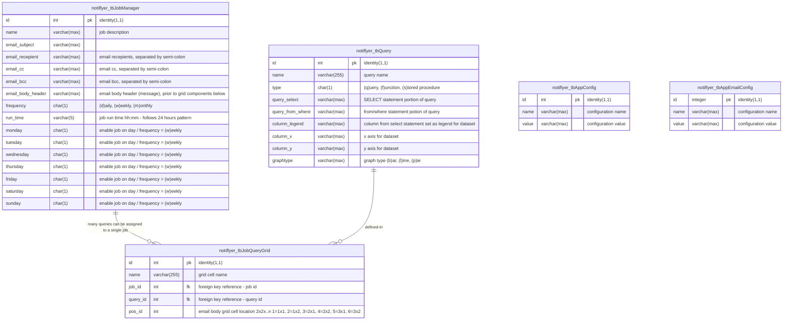

# sql server documentation 

## navigation
- [overview](#overview)
    - [entity-relationship (er) diagram](#erdiagram)  
- [prerequisites](#prerequisites)
    - cpu/memory/storage
    - mssql version
    - containerization
- [installation guide](#installation-guide)
    - quick start guide
    - complete installation guide
        - chartjs microservice container
        - application first-run configuration
  
## overview
todo:
this section will describe the inner workings and setup instructions
[scroll top](#top)

## entity-relationship (er) diagram

[scroll top](#top)
## prerequisites
[scroll top](#top)
## installation guide
[scroll top](#top)
