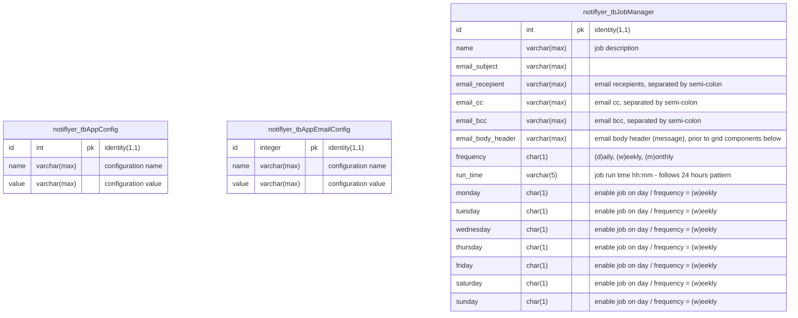

```mermaid
erDiagram
    notiflyer_tbAppConfig {
        id int pk "identity(1,1)"
        name varchar(max) "configuration name"
		value varchar(max) "configuration value"
    }

    notiflyer_tbAppEmailConfig {
        id integer pk "identity(1,1)"
		name varchar(max) "configuration name"
		value varchar(max) "configuration value"
    }

    notiflyer_tbJobManager {
        id int pk "identity(1,1)"
        name varchar(max) "job description"
        email_subject varchar(max)
        email_recepient varchar(max) "email recepients, separated by semi-colon"
        email_cc varchar(max) "email cc, separated by semi-colon"
        email_bcc varchar(max) "email bcc, separated by semi-colon"
		email_body_header varchar(max) "email body header (message), prior to grid components below"
        frequency char(1) "(d)aily, (w)eekly, (m)onthly"
		run_time varchar(5) "job run time hh:mm - follows 24 hours pattern"
		monday char(1) "enable job on day / frequency = (w)eekly"
		tuesday char(1) "enable job on day / frequency = (w)eekly"
		wednesday char(1) "enable job on day / frequency = (w)eekly"
		thursday char(1) "enable job on day / frequency = (w)eekly"
		friday char(1) "enable job on day / frequency = (w)eekly"
		saturday char(1) "enable job on day / frequency = (w)eekly"
		sunday char(1) "enable job on day / frequency = (w)eekly"
    }    
```