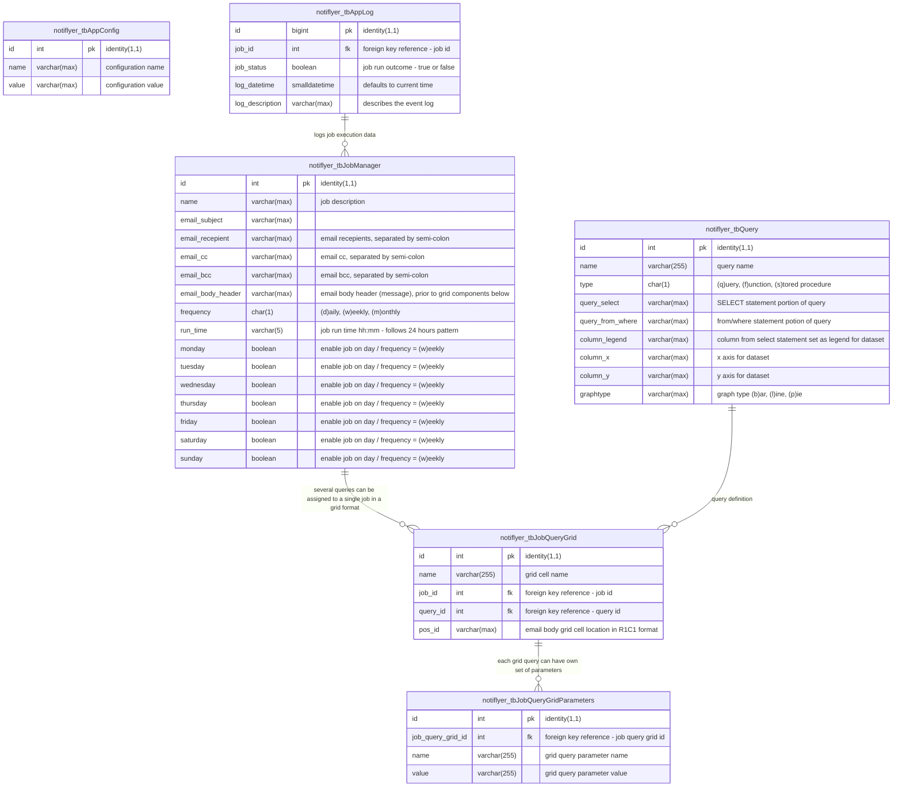

# sql server documentation 

## navigation

- [overview](#overview)
  - [entity-relationship (er) diagram](#entity-relationship-er-diagram)
  - [custom database objects](#custom-database-objects)
- [prerequisites](#prerequisites)
  - cpu/memory/storage
  - mssql version
  - containerization
- [installation guide](#installation-guide)
  - [quick start guide](#quick-start-guide)
  - [complete installation guide](#complete-installation-guide)
    - chartjs microservice container
    - application first-run configuration

## overview

todo:
this section will describe the inner workings and setup instructions

[scroll top](#top)

## entity-relationship (er) diagram

[scroll top](#top)

## custom database objects

notiflyer relies on a set of custom sql objects that help facilitate the workflow in storing and configuring application specific settings, and setting up workflow jobs. this documentation strives to keep every custom object that notiflyer uses, documented for future upgrades/testing/debugging/maintenance.

the objective of defining these custom objects is to reaffirm it's need, definition and location/time of its utilization as part of the application. to reduce redundancy, the object descriptions below will be limited to explaining the **_purpose/mission_**, any **_relevant columns_** that need additional explaination, and/or any **_maiden-run variables_** that need to be setup at the first time notiflyer is run

### tables

1. **notiflyer_tbAppConfig**

   - **_purpose/mission_**

   notiflyer requires to be instantiated with information regarding the target database that notiflyer will be working off of

   **notiflyer_tbAppConfig** is considered as the "entry-point" for notiflyer to store several application-level configuration parameters, that would be either prepopulated by [install.sql](/src/mssql/99_install_app/install.sql) or asked to be manually enterered on the maiden run of the application based on the end-user's environment

   notiflyer (_currently_) relies on using email functionality provided by built-in system functionality specific to database vendors.

   - **_maiden-run variables_** 

   when the application is installed/run for the first time (maiden-run), either by running the [install.sql](/src/mssql/99_install_app/install.sql) script or using the [notiflyer_app](https://github.com/cleancoda/notiflyer_app) (_currently in development_) gui application, it will prompt the end-user to enter values for the following **required** configuration parameters

   | config-name          | application/use                         |
   | -------------------- | --------------------------------------- |
   | `sqlserver.name`     | name of the target mssql server         |
   | `sqlserver.username` | user-name with sysadmin role privileges |
   | `sqlserver.password` | password for above account              |
   | `sqlserver.database` | name of target database                 |

   microsoft sql server serves emails via [database mail stored procedures](https://learn.microsoft.com/en-us/sql/relational-databases/system-stored-procedures/database-mail-stored-procedures-transact-sql?view=sql-server-ver16), however, requires some preconfigured values to be passed along with the recipient/body of the email to ensure it can propagate correctly

   | config-name     | application/use                    |
   | --------------- | ---------------------------------- |
   | `email.account` | name of the target mssql server    |
   | `email.profile` | user-name with db_owner privileges |

   if an existing account/profile is not available, notiflyer can create one for you (_currently in development_)

2. **notiflyer_tbAppLog**

   - **_purpose/mission_**

   logging is a key part of the workflow to have a trail of breadcrumbs to follow back to the origin of the scenario. **notiflyer_tbAppLog** will capture each job run and mark down whether the run was successful and any additional notes/descriptions if necessary.

3. **notiflyer_tbQuery**

   - **_purpose/mission_**

   job query definitions for notiflyer will be stored in **notiflyer_tbQuery**. currently supports plain t-sql queries, support for functions, stored procedures, and in-line functions will be added soon

4. **notiflyer_tbJobManager**

   - **_purpose/mission_**

   notiflyer works off of generating individual automated sql jobs that invoke and run procedures depending on the type of job it runs. **notiflyer_tbJobManager** allows end-users to setup individual jobs for notiflyer - which in turn generates the required sql job and associated a schedule to it.

   microsoft sql server has a dedicated windows service to execute scheduled administrative tasks called as ["sql jobs"](https://learn.microsoft.com/en-us/sql/ssms/agent/sql-server-agent) whenever a new entry is added to **notiflyer_tbJobManager** a corresponding dml trigger will fire and call upon another routine that will setup the required sql agent job for the new entry that was added.

5. **notiflyer_tbJobQueryGrid**

   - **_purpose/mission_**

   any job setup under notiflyer can be customized per the end-user's preferences. **notiflyer_tbJobQueryGrid** allows you to break out the body of the email into a grid format, setting a cell value for each entry (R1C1 format) in the table.

   every corresponding cell can be setup to utilize a separate query from **notiflyer_tbQuery** which in turn, could be either a visual, a simple table or have custom embedded objects (_coming soon_).

6. **notiflyer_tbJobQueryGridParameters**

   - **_purpose/mission_**

   as each cell on a job can be customized to use it's own unique query, that corresponding query may require additional paramters to be passed to it at run time. **notiflyer_tbJobQueryGridParameters** stores parameters for such queries

   using this approach, a single query can be reused on different jobs, with their own unique set of parameters, allowing us to reuse the query without having to rewrite the code again, only to change the value of parameters being passed to it.

### views

### triggers

1. **notiflyer_trJobManager_insert**

   - **_purpose/mission_**

   whenever a new entry is added to **notiflyer_tbJobManager**, an insert dml trigger labeled **notiflyer_trJobManager_insert** will fire and in turn call other stored procedure(s) **notiflyer_spCreateSQLAgentJob** followed by **notiflyer_spCreateSQLAgentJobSchedule** to setup the required sql agent job and schedule for the new entry that was added to **notiflyer_tbJobManager**

2. **notiflyer_trJobManager_update**

   - **_purpose/mission_**

   whenever a new entry is updated on **notiflyer_tbJobManager**, an update dml trigger labeled **notiflyer_trJobManager_update** will fire and in turn call other stored procedure(s) **notiflyer_spUpdateSQLAgentJob** followed by **notiflyer_spUpdateSQLAgentJobSchedule** to setup the required sql agent job and schedule for the entry that was updated under **notiflyer_tbJobManager**

3. **notiflyer_trJobManager_delete**

   - **_purpose/mission_**

   whenever an existing entry is deleted from **notiflyer_tbJobManager**, a delete dml trigger labeled **notiflyer_trJobManager_delete** will fire and in turn call other stored procedure(s) **notiflyer_spDeleteSQLAgentJobSchedule** followed by **notiflyer_spDeleteSQLAgentJob** to remove the existing sql agent job and schedule for the entry that was just deleted under **notiflyer_tbJobManager**

### functions

### stored procedures

1. **notiflyer_spCreateSQLAgentJob**

   - **_purpose/mission_**

   every new job that is setup under notiflyer_tbJobManager table, will require a corresponding sql agent job and a schedule to be setup. **notiflyer_spCreateSQLAgentJob** stored procedure allows notiflyer to automatically generate a new sql job depending on the job manager configuration parameters

2. **notiflyer_spCreateSQLAgentJobSchedule**

   - **_purpose/mission_**

   for any new job generated, a corresponding schedule is required to "automate" it's execution. **notiflyer_spCreateSQLAgentJobSchedule** stores the necessary configuration settings to automate the run

3. **notiflyer_spUpdateSQLAgentJob**

   - **_purpose/mission_**

   any changes made to an existing job that is setup under **notiflyer_tbJobManager** table, will require a corresponding sql agent job and a schedule to be updated. **notiflyer_spUpdateSQLAgentJob** stored procedure allows notiflyer to update the existing sql job depending on the job manager configuration parameters that were updated/changed

4. **notiflyer_spUpdateSQLAgentJobSchedule**

   - **_purpose/mission_**

   any existing job that gets updated, the matching job agent schedule needs to match those changes. **notiflyer_spUpdateSQLAgentJobSchedule** updates the necessary configuration settings

5. **notiflyer_spDeleteSQLAgentJob**

   - **_purpose/mission_**

   any existing job that is setup under **notiflyer_tbJobManager** table gets deleted, will require a corresponding sql agent job schedule to be dropped first, followed by the job itself. **notiflyer_spDeleteSQLAgentJob** stored procedure allows notiflyer to remove any existing sql job.

6. **notiflyer_spDeleteSQLAgentJobSchedule**

   - **_purpose/mission_**

   before deleting the job, the associated schedule needs to be removed first - **notiflyer_spDeleteSQLAgentJobSchedule** needs to be fired prior to **notiflyer_spDeleteSQLAgentJob**

### sql jobs

[scroll top](#top)

## prerequisites

[scroll top](#top)

## installation guide

notiflyer has a few moving parts that need to be setup and configured prior to going live for production use.

this documentation has been split into two sections:

- [quick start guide](#quick-start-guide)
- [complete installation guide](#complete-installation-guide)

[scroll top](#top)

### quick start guide

---

### complete installation guide

---

#### chartjs microservice container

notiflyer relies on an HTML5 javascript library [chartjs](https://github.com/chartjs/Chart.js), that accepts json payload parameters and returns an url to a dynamically generated image based off the parameters it receives.

the quickest way to deploy a runnable container in Docker would be to utilize another wrapper library called [quickchart](https://github.com/typpo/quickchart) that generates a web api for generating static charts

#### application first-run configuration

[scroll top](#top)
