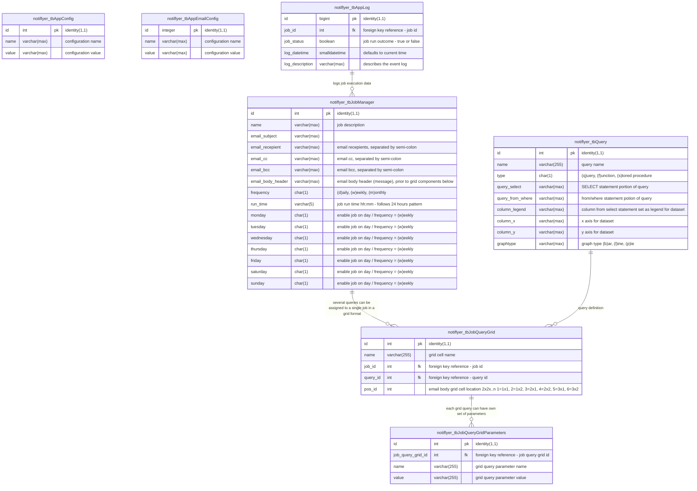

# sql server documentation 

## navigation
- [overview](#overview)
    - [entity-relationship (er) diagram](#entity-relationship-er-diagram)
    - [custom database objects]  
- [prerequisites](#prerequisites)
    - cpu/memory/storage
    - mssql version
    - containerization
- [installation guide](#installation-guide)
    - quick start guide
    - complete installation guide
        - chartjs microservice container
        - application first-run configuration
  
## overview
todo:
this section will describe the inner workings and setup instructions

[scroll top](#top)

## entity-relationship (er) diagram

[scroll top](#top)
## custom database objects
notiflyer relies on a set of custom sql objects that help facilitate the workflow in storing and configuring application specific settings, and setting up workflow jobs. this documentation strives to keep every custom object that notiflyer uses, documented for future upgrades/testing/debugging/maintenance. 

the objective of defining these custom objects is to reaffirm it's need, definition and location/time of its utilization as part of the application

### tables
1. **notiflyer_tbAppConfig**
    - ***purpose/mission***

    this table is considered as the "entry-point" for notiflyer to store several application-level configuration parameters, that would be either prepopulated by [install.sql](/src/mssql/99_install_app/install.sql) or asked to be manually enterered on the maiden run of the application based on the end-user's environment

    - ***maiden-run variables*** 

    when the application is installed/run for the first time (maiden-run), either by running the [install.sql](/src/mssql/99_install_app/install.sql) script or using the [notiflyer_app](https://github.com/cleancoda/notiflyer_app) (*currently in development*) gui application, it will prompt the end-user  to enter values for the following **required** configuration parameters

    | config-name  | description 
    | ------------- | ------------- |
    | `sqlserver.name` | name of the target mssql server |
    | `sqlserver.username` | user-name with db_owner privileges |
    | `sqlserver.password` | password for above account |
    | `sqlserver.database` | name of target database |

2. **notiflyer_tbAppLog**
    - ***purpose/mission***

    logging is a key part of the workflow to have a trail of breadcrumbs to follow back to the origin of the scenario. **notiflyer_tbAppLog** will capture each job run and mark down whether the run was successful and any additional notes/descriptions if necessary.
    
3. **notiflyer_tbQuery**
    - ***purpose/mission***

    job query definitions for notiflyer will be stored in **notiflyer_tbQuery** 
    
### views

### triggers

### functions

### stored procedures

### sql jobs

[scroll top](#top)
## prerequisites
[scroll top](#top)
## installation guide
[scroll top](#top)

### quick start guide
---
### complete installation guide
---
#### chartjs microservice container
notiflyer relies on an HTML5 javascript library [chartjs](https://github.com/chartjs/Chart.js), that accepts json payload parameters and returns an url to a dynamically generated image based off the parameters it receives.

the quickest way to deploy a runnable container in Docker would be to utilize another wrapper library called [quickchart](https://github.com/typpo/quickchart) that generates a web api for generating static charts
#### application first-run configuration
[scroll top](#top)

| name  | data-type | default-value | purpose 
| ------------- | ------------- | ------------- | ------------- |
| id  | int  | identity(1,1) | auto-incrementing unique identifier |
| name  | varchar(max)  | `null` | name of the config variable |
| value  | varchar(max)  | `null` | value for the config variable |